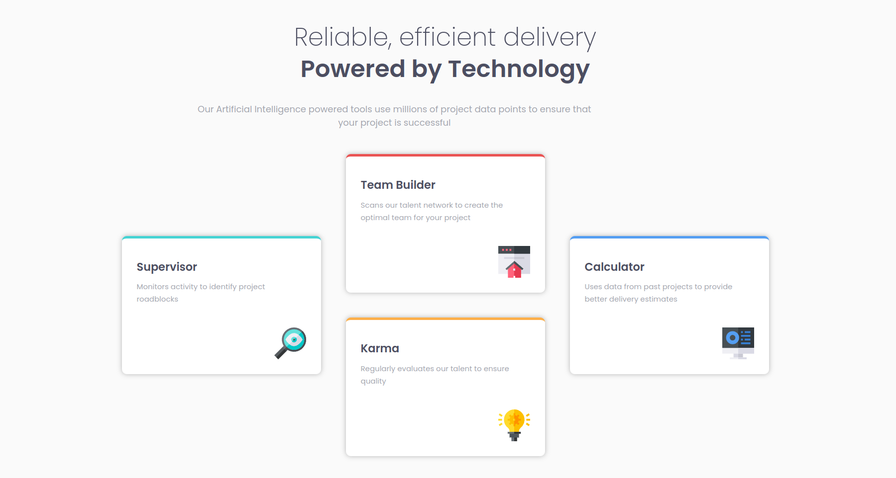
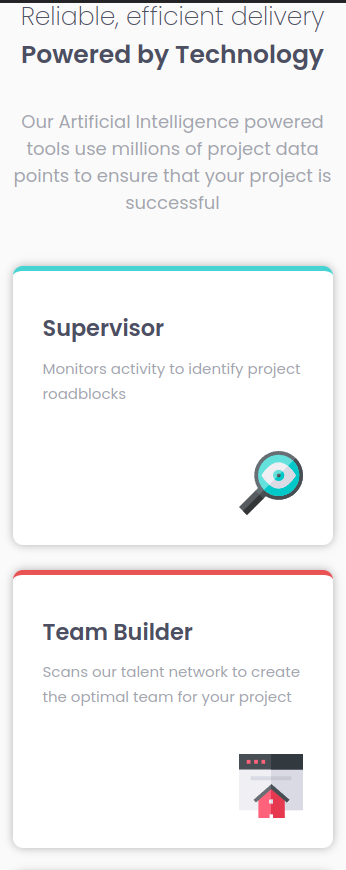
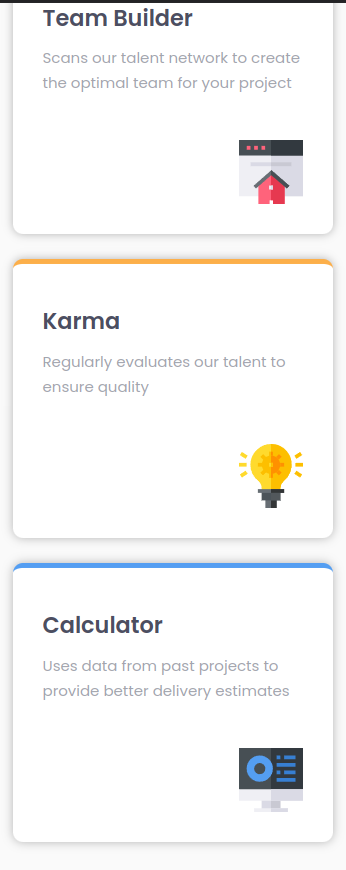

# Frontend Mentor - Four card feature section solution

This is a solution to the [Four card feature section challenge on Frontend Mentor](https://www.frontendmentor.io/challenges/four-card-feature-section-weK1eFYK). Frontend Mentor challenges help you improve your coding skills by building realistic projects.

## Table of contents

- [Overview](#overview)
  - [The challenge](#the-challenge)
  - [Screenshot](#screenshot)
  - [Links](#links)
- [My process](#my-process)
  - [Built with](#built-with)
  - [What I learned](#what-i-learned)
  - [Continued development](#continued-development)
- [Author](#author)
- [Acknowledgments](#acknowledgments)

## Overview

### The challenge

Users should be able to:

- View the optimal layout for the site depending on their device's screen size

### Screenshot

### Links

* Solution URL: [GitHub](https://github.com/MonarchRyuzaki/Four-Card-Feature-Section)
* Live Site URL: [Live Here !!](https://monarchryuzaki.github.io/Four-Card-Feature-Section/)

## My process

### Built with

- Semantic HTML5 markup
- CSS custom properties
- Flexbox

### What I learned

Actually, The main Design was pretty simple. The challenge was in making the layout responsive for various screen sizes. Here I followed the usual way, the way I used to do things(i.e, Desktop First). This made me realize that a lot of code is repeated and is probably not the best way. From next challenge onwards, I will be using the mobile First Workflow, and maybe redo this later

### Continued development

Get more Experience on Making Responsive Layouts and use the mobile first workflow from next time.

### Author

* LinkedIn - [Shivam Ganguly](https://www.linkedin.com/in/shivam-ganguly-357b90255/)
* Frontend Mentor - [@MonarchRyuzaki](https://www.frontendmentor.io/profile/MonarchRyuzaki)

## Acknowledgments

Special Thanks to [Colt Steele](https://www.udemy.com/user/coltsteele/) for his [Web Development Bootcamp](https://www.udemy.com/course/the-web-developer-bootcamp/).
